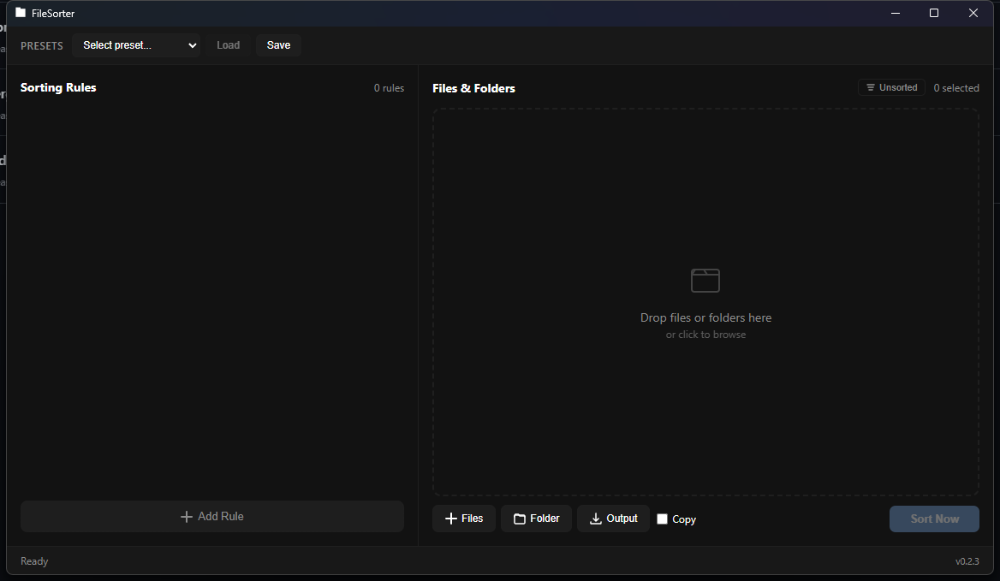

# FileSorter

A cross-platform desktop application that organizes files into subfolders based on user-defined filename rules. Built with Tauri v2 (Rust) and Svelte 5.

## Screenshot



## How It Works

FileSorter uses an ordered list of rules to sort files into folders. Each rule has three fields:

| Field | Required | Description |
|---|---|---|
| **Contains** | Yes | Substring to match in filenames (case-insensitive) |
| **Contains NOT** | No | Exclusion substring — skip files that also contain this |
| **Target Folder** | Yes | Folder name to move matching files into |

Rules execute **top-to-bottom in order**. Each rule walks the entire directory tree recursively, so Rule 2 sees the filesystem *after* Rule 1 has already moved files. This lets you build intricate nested folder structures in a single pass.

### Example

Given these rules:

| # | Contains | Contains NOT | Target Folder |
|---|---|---|---|
| 1 | `16x9` | | `16x9` |
| 2 | `9x16` | | `9x16` |
| 3 | `1x1` | | `1x1` |
| 4 | `_30s` | | `30s` |
| 5 | `_15s` | | `15s` |
| 6 | `_6s` | | `6s` |

And these files:
```
ClientName_CampaignA_16x9_30s_v01.mp4
ClientName_CampaignA_16x9_15s_v01.mp4
ClientName_CampaignA_9x16_30s_v01.mp4
ClientName_CampaignA_9x16_15s_v01.mp4
ClientName_CampaignA_1x1_6s_v01.mp4
```

After sorting:
```
16x9/
  30s/
    ClientName_CampaignA_16x9_30s_v01.mp4
  15s/
    ClientName_CampaignA_16x9_15s_v01.mp4
9x16/
  30s/
    ClientName_CampaignA_9x16_30s_v01.mp4
  15s/
    ClientName_CampaignA_9x16_15s_v01.mp4
1x1/
  6s/
    ClientName_CampaignA_1x1_6s_v01.mp4
```

Rules 1–3 move each file into its aspect ratio folder. Rules 4–6 then walk again and sort within those folders by duration — building a full `aspect/duration/` hierarchy in a single pass.

## Installing

Binaries are available on the [Releases](https://github.com/polisvfx/FileSorter/releases) page. Because FileSorter is open source and unsigned (no paid certificate), your OS may show a security warning on first launch.

### macOS

Gatekeeper will block the app from opening. To allow it:

**Option 1 — Right-click open** (easiest):
1. Right-click `FileSorter.dmg` → Open
2. Right-click the installed app → Open → click Open in the dialog

**Option 2 — System Settings**:
System Settings → Privacy & Security → scroll down → click **Open Anyway**

**Option 3 — Terminal** (removes the macOS quarantine flag):
```bash
xattr -cr /Applications/FileSorter.app
```

### Windows

SmartScreen will show "Windows protected your PC":
1. Click **More info**
2. Click **Run anyway**

## Features

- **Drag-and-drop rule reordering** — drag rules to change execution order
- **File & folder input** — drop files/folders from your OS file browser or use the native browse dialog
- **Saveable presets** — save and load rule configurations for different workflows
- **Undo** — reverse the last sort operation, restoring all files to their original locations
- **Filename conflict handling** — appends `(1)`, `(2)`, etc. when a file with the same name already exists in the target folder
- **Cross-platform** — runs natively on Windows, macOS, and Linux

## Development

### Prerequisites

- [Node.js](https://nodejs.org/) 22+
- [Rust](https://rustup.rs/) stable
- Platform-specific dependencies:
  - **Windows**: Visual Studio Build Tools with C++ workload and Windows SDK
  - **Linux**: `libwebkit2gtk-4.1-dev libappindicator3-dev librsvg2-dev patchelf`
  - **macOS**: Xcode Command Line Tools

### Setup

```bash
npm install
npm run tauri dev
```

### Build

```bash
npm run tauri build
```

The compiled binary will be in `src-tauri/target/release/`.

## Releases

Push a version tag to trigger the GitHub Actions release workflow:

```bash
git tag v0.1.0
git push origin v0.1.0
```

This builds native binaries for Windows (.msi, .exe), macOS (.dmg), and Linux (.deb, .AppImage) and creates a draft GitHub Release.

## License

[GNU General Public License v3.0](LICENSE)
