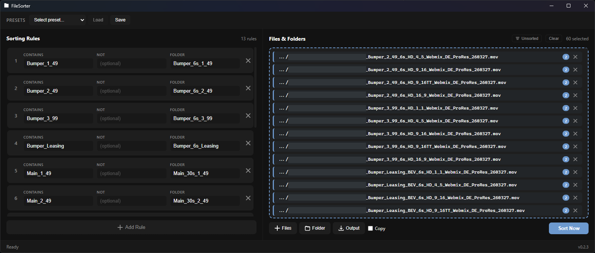

# FileSorter

A cross-platform desktop application that organizes files into subfolders based on user-defined filename rules. Built with Tauri v2 (Rust) and Svelte 5.

## Screenshot



## How It Works

FileSorter uses an ordered list of rules to sort files into folders. Each rule has three fields:

| Field | Required | Description |
|---|---|---|
| **Contains** | Yes | Substring(s) to match in filenames (case-insensitive). Supports `,` (OR) and `*` (AND) — see below |
| **Contains NOT** | No | Exclusion substring(s) — skip files that also match this. Supports the same `,`/`*` syntax |
| **Target Folder** | Yes | Folder name to move matching files into |
| **Enabled** | Yes (default on) | Untick to skip this rule during sorting without deleting it |
| **Stop on Match** | No (default off) | When a file matches this rule, skip all later rules for that file |
| **Match** | Yes (default Name) | Which part of the file to test: `Name` (with extension), `Stem` (without), `Ext` (extension only), or `Path` (full path, so you can match parent folders) |
| **Aa** | No (default off) | Case-sensitive matching |
| **.\*** | No (default off) | Treat Contains / Contains NOT as regular expressions. `,` and `*` lose their special meaning — regex has its own syntax |

Rules execute **top-to-bottom in order**, and each matching rule adds one folder level, so rules compose into nested structures in a single pass. Setting an output directory changes where the tree is rooted, not how it nests.

### Contains / Contains NOT operators

`Contains` and `Contains NOT` accept simple boolean expressions:

- `,` means **OR** — `invoice,receipt` matches filenames containing either `invoice` or `receipt`.
- `*` means **AND** — `invoice*2024` matches filenames containing both `invoice` and `2024`.
- `*` binds tighter than `,`, so `invoice*2024,receipt` means `(invoice AND 2024) OR receipt`.

If `Target Folder` is left blank, the folder name falls back to the `Contains` value with `,`/`*` replaced by spaces (e.g. `invoice*2024` → folder `invoice 2024`), since `*` isn't a valid character in folder names on Windows.

### Folder tokens

`Target Folder` accepts tokens that are filled in per file, so **one rule can produce many folders**:

| Token | Becomes |
|---|---|
| `{ext}` | The extension, lowercased, without the dot |
| `{stem}` | The filename without its extension |
| `{name}` | The full filename |
| `{YYYY}` `{MM}` `{DD}` | Year / month / day the file was last modified |
| `$1` … `$9` | Regex capture groups (regex mode only) |

A `/` in the template still nests, so `Media/{ext}/{YYYY}` builds a three-level tree. Token *values* are sanitised, so a capture can never inject a path separator.

This is what collapses a long rule list. The six-rule example below can be written as two rules using `{ext}`-style tokens, and sorting a photo library by date is a single rule with folder `{YYYY}/{MM}`.

### Example

Given these rules:

| # | Contains | Contains NOT | Target Folder |
|---|---|---|---|
| 1 | `16x9` | | `16x9` |
| 2 | `9x16` | | `9x16` |
| 3 | `1x1` | | `1x1` |
| 4 | `_30s` | | `30s` |
| 5 | `_15s` | | `15s` |
| 6 | `_6s` | | `6s` |

And these files:
```
ClientName_CampaignA_16x9_30s_v01.mp4
ClientName_CampaignA_16x9_15s_v01.mp4
ClientName_CampaignA_9x16_30s_v01.mp4
ClientName_CampaignA_9x16_15s_v01.mp4
ClientName_CampaignA_1x1_6s_v01.mp4
```

After sorting:
```
16x9/
  30s/
    ClientName_CampaignA_16x9_30s_v01.mp4
  15s/
    ClientName_CampaignA_16x9_15s_v01.mp4
9x16/
  30s/
    ClientName_CampaignA_9x16_30s_v01.mp4
  15s/
    ClientName_CampaignA_9x16_15s_v01.mp4
1x1/
  6s/
    ClientName_CampaignA_1x1_6s_v01.mp4
```

Rules 1–3 move each file into its aspect ratio folder. Rules 4–6 then walk again and sort within those folders by duration — building a full `aspect/duration/` hierarchy in a single pass.

## Installing

Binaries are available on the [Releases](https://github.com/polisvfx/FileSorter/releases) page. Because FileSorter is open source and unsigned (no paid certificate), your OS may show a security warning on first launch.

### macOS

Gatekeeper will block the app from opening. To allow it:

**Option 1 — Right-click open** (easiest):
1. Right-click `FileSorter.dmg` → Open
2. Right-click the installed app → Open → click Open in the dialog

**Option 2 — System Settings**:
System Settings → Privacy & Security → scroll down → click **Open Anyway**

**Option 3 — Terminal** (removes the macOS quarantine flag):
```bash
xattr -cr /Applications/FileSorter.app
```

### Windows

Two options are published:

- **Installer** — `FileSorter_<version>_x64-setup.exe` or `.msi`
- **Portable** — `FileSorter_<version>_x64_portable.exe`, a single self-contained executable that needs no installation. Settings and presets are still stored in `%APPDATA%\com.filesorter.app`, so it is portable in the "no install" sense rather than the "leaves no trace" sense.

The portable build relies on the WebView2 runtime, which is part of Windows 11 and reaches Windows 10 through Windows Update — present on virtually every current machine. If it is missing, install the [Evergreen WebView2 Runtime](https://developer.microsoft.com/microsoft-edge/webview2/) or use the installer, which bundles it.

Either way, SmartScreen will show "Windows protected your PC":
1. Click **More info**
2. Click **Run anyway**

## Features

- **Dry-run preview** — switch the right panel to **Preview** to see exactly where every file will land, grouped by destination folder, before anything moves. Conflict suffixes are simulated too, so the names shown are the names you get
- **Drag-and-drop rule reordering** — drag rules to change execution order
- **Regex, case sensitivity, and match scope** — per rule, matched against the name, stem, extension, or full path
- **Folder tokens** — `{ext}`, `{YYYY}`, regex captures and more, so one rule builds many folders
- **Enable/disable rules** — toggle a rule off without losing its configuration
- **Duplicate a rule** — copy a rule in place instead of retyping near-identical ones
- **Stop on Match** — mark a rule as final so matching files skip all later rules
- **Live progress with cancel** — a progress bar counts files as they move, and Cancel stops the run cleanly; anything already moved stays undoable
- **File & folder input** — drop files/folders from your OS file browser or use the native browse dialog. Dropped folders stay collapsed to a single row showing their file count, so a 50,000-file folder is one entry rather than 50,000
- **Saveable presets** — save and load rule configurations for different workflows
- **Undo** — reverse the last sort operation, restoring all files to their original locations
- **Filename conflict handling** — appends `(1)`, `(2)`, etc. when a file with the same name already exists in the target folder
- **Cross-platform** — runs natively on Windows, macOS, and Linux

## Development

### Prerequisites

- [Node.js](https://nodejs.org/) 22+
- [Rust](https://rustup.rs/) stable
- Platform-specific dependencies:
  - **Windows**: Visual Studio Build Tools with C++ workload and Windows SDK
  - **Linux**: `libwebkit2gtk-4.1-dev libappindicator3-dev librsvg2-dev patchelf`
  - **macOS**: Xcode Command Line Tools

### Setup

```bash
npm install
npm run tauri dev
```

### Build

```bash
npm run tauri build
```

The compiled binary will be in `src-tauri/target/release/`.

## Releases

Push a version tag to trigger the GitHub Actions release workflow:

```bash
git tag v0.1.0
git push origin v0.1.0
```

This builds native binaries for Windows (.msi, .exe), macOS (.dmg), and Linux (.deb, .AppImage) and creates a draft GitHub Release.

## License

[GNU General Public License v3.0](LICENSE)
